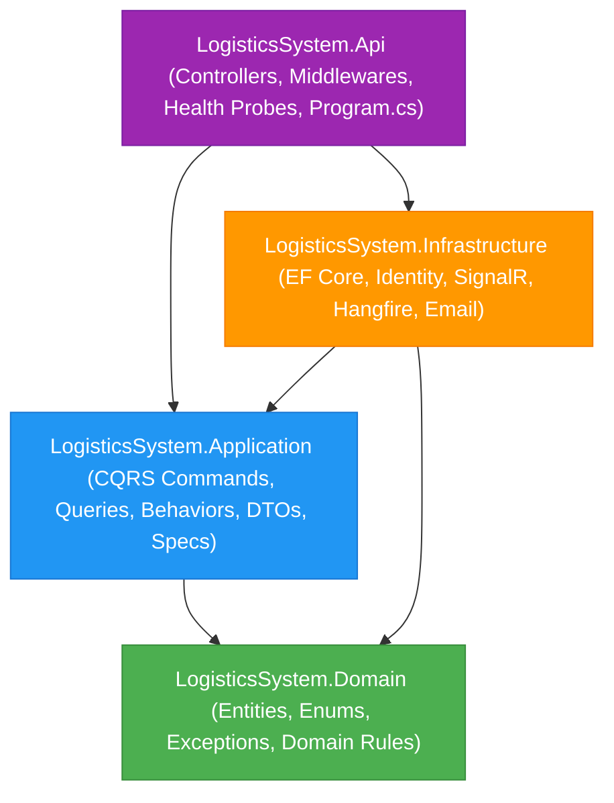
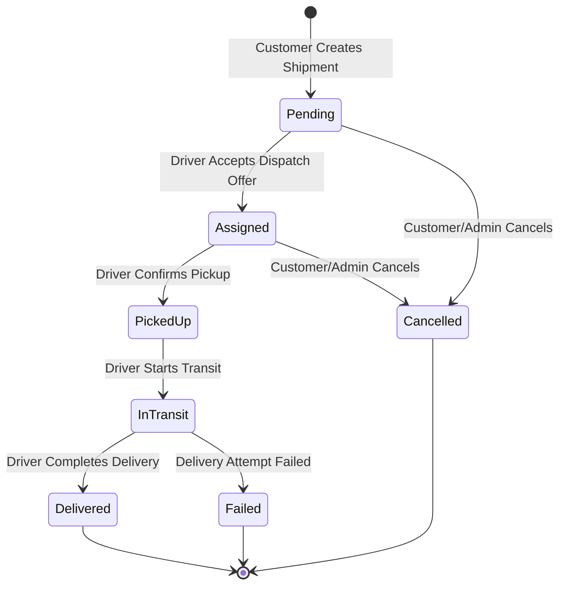
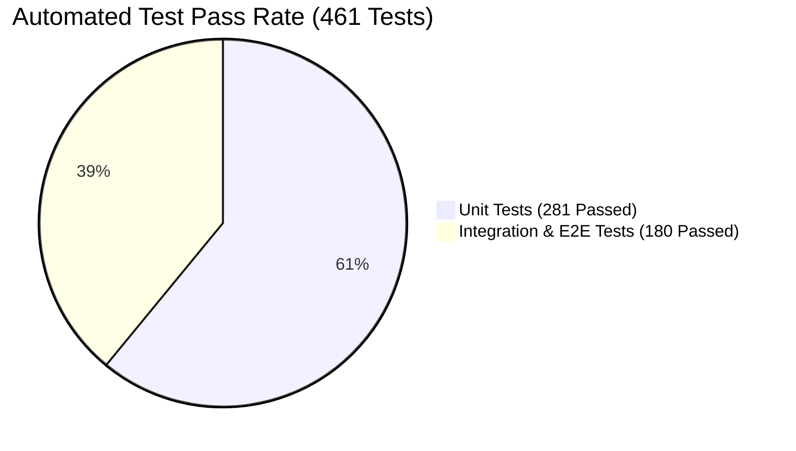

# Logistics System API 🚚📦

[](https://dotnet.microsoft.com/download/dotnet/10.0)
[](https://learn.microsoft.com/en-us/dotnet/csharp/)
[](https://blog.cleancoder.com/uncle-bob/2012/08/13/the-clean-architecture.html)
[](https://github.com/jbogard/MediatR)
[-success?style=flat&logo=githubactions&logoColor=white)](tests/)
[-2496ED?style=flat&logo=docker&logoColor=white)](Dockerfile)
[](LICENSE)

An enterprise-grade, high-performance Logistics & Supply Chain Management Web API built with **.NET 10 (C# 14)**, **ASP.NET Core**, and **Clean Architecture**. The system provides end-to-end automated driver dispatching, real-time GPS tracking over WebSockets, fleet management, and fine-grained role-based access control.

---

## Table of Contents
- [Architecture & Design](#architecture--design)
- [Domain State Machine](#domain-state-machine)
- [Key Features](#key-features)
- [Technology Stack](#technology-stack)
- [API Modules & Endpoints](#api-modules--endpoints)
- [Solution Structure](#solution-structure)
- [Getting Started](#getting-started)
  - [Prerequisites](#prerequisites)
  - [Running with Docker Compose](#running-with-docker-compose)
  - [Running Locally with .NET CLI](#running-locally-with-net-cli)
- [Automated Testing](#automated-testing)
- [Production Readiness & Security](#production-readiness--security)
- [Documentation & Operations](#documentation--operations)

---

## Architecture & Design

The solution strictly adheres to **Clean Architecture** principles and the **CQRS (Command Query Responsibility Segregation)** pattern. The domain model contains pure enterprise business logic and remains completely independent of frameworks, databases, and UI concerns.



### CQRS & Request Pipeline Behaviors
Every command and query flows through a structured MediatR pipeline:
1. **UnhandledExceptionBehavior**: Catches unhandled exceptions and standardizes logging.
2. **PerformanceBehavior**: Detects and logs warnings for slow queries exceeding 500 ms threshold.
3. **LoggingBehavior**: Emits structured start, execution time, and user identity telemetry.
4. **ValidationBehavior**: Executes FluentValidation rules before hitting domain handlers.

---

## Domain State Machine

The shipment lifecycle is guarded by an explicit state machine validator ([`ShipmentStatusTransitionValidator`](src/LogisticsSystem.Application/Features/Shipments/Helpers/ShipmentStatusTransitionValidator.cs)) with status history auditing and concurrency safety:



---

## Key Features

### 🚀 1. Automated Dispatch & Nearest Driver Engine
- **Haversine Distance Matching**: Automatically calculates geographical distance ($R = 6371\text{ km}$) to locate the nearest available driver.
- **Hangfire Job Scheduling**: Enqueues automatic dispatch jobs on shipment creation with background retry policies.
- **Assignment Expiration & Fallback**: Minutely recurring cron job detects driver response timeouts, marks offers expired, and automatically reassigns shipments to the next nearest driver.

### 📡 2. Real-Time Telematics & SignalR Hubs
- **GPS Telematics Stream**: Ingests driver coordinates and streams live telemetry to subscribed customers over `/hubs/tracking`.
- **Live Notifications**: Direct user-targeted notification push over `/hubs/notifications`.
- **Query-String JWT Authentication**: Seamless WebSocket authentication with automatic claim extraction and connection-level security.

### 🔐 3. Enterprise Security & Identity
- **JWT & Sliding Refresh Tokens**: HMAC-SHA256 bearer tokens with 64-byte cryptographic refresh token rotation and replay revocation.
- **Fine-Grained RBAC**: 4 distinct roles (`Admin`, `Dispatcher`, `Driver`, `Customer`) with ownership-isolated data access.
- **Admin Self-Protection**: Enforces rules preventing administrators from deactivating/deleting their own accounts or removing their own `Admin` role.
- **Multi-Tier Rate Limiting**: Partitioned rate limiters:
  - **Auth**: `5 req/min` (anti-brute-force)
  - **Admin**: `20 req/min`
  - **Tracking Telematics**: `120 req/min` (high-throughput GPS ingestion)
  - **Global**: `100 req/min`

### 📊 4. High-Performance Dashboard & Analytics
- **Single Round-Trip Aggregation**: Dashboard metrics query all 7 shipment statuses and driver fleet availability in a single round-trip using `.GroupBy(_ => 1)`.
- **Composite Indexing**: Optimized covering indexes on `(CustomerId, CreatedAt)` and `(Status, CreatedAt)` for fast pagination on high-volume tables.

### 🚙 5. Fleet & Vehicle Management
- Complete vehicle inventory CRUD with plate number uniqueness enforcement.
- Driver-vehicle allocation with conflict validation and deletion protection for assigned vehicles.

---

## Technology Stack

| Layer / Concern | Technologies |
|---|---|
| **Runtime & Framework** | .NET 10.0, C# 14, ASP.NET Core Web API |
| **Architecture** | Clean Architecture, CQRS, Specification Pattern, Repository Pattern |
| **Mediator & Validation** | MediatR 14, FluentValidation 12, AutoMapper 16 |
| **Data & Persistence** | EF Core 10, SQL Server 2022, Audit Save Interceptors |
| **Real-Time WebSockets** | ASP.NET Core SignalR |
| **Background Jobs** | Hangfire 1.8 with SQL Server Storage |
| **Security & Auth** | ASP.NET Core Identity, JWT Bearer, Sliding Refresh Tokens |
| **Observability & Health** | Serilog Structured Logging, Correlation IDs (`X-Correlation-ID`), Health Check Probes |
| **Container & CI/CD** | Multi-stage Dockerfile (`aspnet:10.0`, non-root), GitHub Actions |
| **Automated Testing** | xUnit 3, Moq, FluentAssertions, `WebApplicationFactory` |

---

## API Modules & Endpoints

The API exposes **53 endpoints** grouped into 10 domain controllers:

| Controller | Base Route | Description |
|---|---|---|
| [`AuthController`](src/LogisticsSystem.Api/Controllers/AuthController.cs) | `/api/auth` | Register, Login, Refresh Token, Logout, Email Confirmation, Password Reset |
| [`CustomersController`](src/LogisticsSystem.Api/Controllers/CustomersController.cs) | `/api/customers` | Customer profile management (isolated to authenticated customer) |
| [`DashboardController`](src/LogisticsSystem.Api/Controllers/DashboardController.cs) | `/api/dashboard` | Fleet and shipment aggregate metrics, recent activity timeline |
| [`DispatchController`](src/LogisticsSystem.Api/Controllers/DispatchController.cs) | `/api/dispatch` | Driver offer acceptance, rejection, and driver assignment queue |
| [`DriversController`](src/LogisticsSystem.Api/Controllers/DriversController.cs) | `/api/drivers` | Driver registration, status update, GPS coordinates, vehicle allocation |
| [`NotificationsController`](src/LogisticsSystem.Api/Controllers/NotificationsController.cs) | `/api/notifications` | User notification inbox and mark-as-read |
| [`RolesController`](src/LogisticsSystem.Api/Controllers/RolesController.cs) | `/api/roles` | Role management, role-to-user assignment, system role protection |
| [`ShipmentsController`](src/LogisticsSystem.Api/Controllers/ShipmentsController.cs) | `/api/shipments` | Shipment CRUD, status lifecycle, GPS telematics, tracking timeline |
| [`UsersController`](src/LogisticsSystem.Api/Controllers/UsersController.cs) | `/api/users` | User management, user search, profile updates, account activation/deactivation |
| [`VehiclesController`](src/LogisticsSystem.Api/Controllers/VehiclesController.cs) | `/api/vehicles` | Fleet inventory, vehicle registration, availability queries |

---

## Solution Structure

```
LogisticsSystem/
├── .github/workflows/
│   ├── ci.yml                           # GitHub Actions CI workflow (Build, Test, Docker build)
│   └── deploy.yml                       # GitHub Actions CD workflow (Test verification, Webhook trigger, Health probe)
├── docs/
│   ├── DEPLOYMENT_GUIDE.md              # Production deployment & operations runbook
│   └── PRODUCTION_READINESS_REPORT.md   # Sprint 7 verification checklist & certification report
├── src/
│   ├── LogisticsSystem.Domain/          # Core entities, enums, exceptions, constants (0 dependencies)
│   ├── LogisticsSystem.Application/     # CQRS Commands, Queries, Behaviors, DTOs, Specs, Interfaces
│   ├── LogisticsSystem.Infrastructure/   # EF Core, Identity, SignalR, Hangfire, Repositories, Email
│   └── LogisticsSystem.Api/             # Controllers, Middlewares, Health Probes, Program.cs
├── tests/
│   ├── LogisticsSystem.UnitTests/       # 281 Unit Tests (xUnit 3, Moq, FluentAssertions)
│   └── LogisticsSystem.IntegrationTests/# 180 Integration & E2E Tests (WebApplicationFactory, SignalR)
├── Dockerfile                           # Multi-stage production container build (aspnet:10.0, non-root)
├── docker-compose.yml                   # Local Docker stack (API + SQL Server 2022)
├── .env.example                         # Environment configuration reference
└── README.md
```

---

## Getting Started

### Prerequisites
- [.NET 10 SDK](https://dotnet.microsoft.com/download/dotnet/10.0)
- [SQL Server 2022 / LocalDB / Docker](https://www.microsoft.com/sql-server)
- [Docker Desktop](https://www.docker.com/) (optional for containerized execution)

---

### Running with Docker Compose (Fastest)

Clone the repository and spin up the complete API and SQL Server stack:

```bash
# 1. Clone repository
git clone https://github.com/iAhmadMahmoud/LogisticsSystem.git
cd LogisticsSystem

# 2. Build and start containers
docker-compose up --build
```

- **API URL**: `http://localhost:8080`
- **Swagger Documentation**: `http://localhost:8080/swagger`
- **Hangfire Dashboard**: `http://localhost:8080/hangfire`
- **Health Checks**: `http://localhost:8080/health`

---

### Running Locally with .NET CLI

```bash
# 1. Restore dependencies & build solution
dotnet restore
dotnet build

# 2. Apply EF Core database migrations
dotnet ef database update --project src/LogisticsSystem.Infrastructure --startup-project src/LogisticsSystem.Api

# 3. Run the Web API
dotnet run --project src/LogisticsSystem.Api
```

---

## Automated Testing

The solution contains a comprehensive automated test suite with **461 automated tests** achieving a **100% pass rate**:

```bash
dotnet test --logger "console;verbosity=minimal"
```



### Test Categories Covered:
- **Unit Tests (281)**: Command/query handlers, validation rules, state machine transitions, Haversine formula calculation, password & token generators, audit interceptors.
- **Integration Tests (180)**: Full HTTP lifecycle against in-memory `WebApplicationFactory`, authorization matrix, customer/driver ownership isolation, partition rate limiters (429), CORS preflight, and SignalR WebSocket hub subscriptions.
- **E2E Workflows**: Multi-actor end-to-end scenarios (Customer registration -> Shipment creation -> Real-time driver dispatch offer -> Driver acceptance -> Live GPS streaming -> Delivery completion).

---

## Production Readiness & Security

- **Container Hardening**: Multi-stage Docker image (~106 MB) running as non-root user (`USER $APP_UID`) with built-in container `HEALTHCHECK`.
- **Health Probes**:
  - `/health/live`: Minimal liveness probe for orchestrators.
  - `/health/ready`: Readiness probe checking SQL Server connectivity, Hangfire schema, and email providers.
  - `/health`: Detailed health report with zero secret leakage.
- **Observability**: Serilog daily rolling files (10 MB, 14-day retention) and `X-Correlation-ID` header tracing across all HTTP requests and background jobs.
- **Error Handling**: RFC 7807 problem details with generic error masking for unexpected 500 exceptions in production.

---

## Documentation & Operations

- 📖 **[Production Deployment & Operations Runbook](docs/DEPLOYMENT_GUIDE.md)**: Cloud provisioning, container orchestration, environment variable reference, and backup procedures.
- 📋 **[Production Readiness Verification Report](docs/PRODUCTION_READINESS_REPORT.md)**: Verification checklist, test artifacts, and certification report.

---

## License

This project is licensed under the MIT License — see the [LICENSE](LICENSE) file for details.