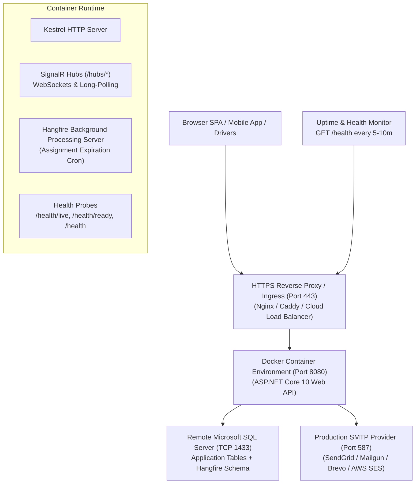

# Production Deployment & Operations Playbook — Logistics System API

This playbook provides comprehensive, production-tested instructions for configuring, deploying, monitoring, and operating the **Logistics System API** in a production container or cloud environment.

---

## 1. Hosting Architecture & Topology

The production architecture is designed around standard, cross-platform containerization and enterprise SQL Server persistence:



| Component | Architecture / Role | Description |
|---|---|---|
| **App Service** | Docker Container / Web Service | Runs the multi-stage .NET 10 rootless container (`USER $APP_UID`), binding to internal port `8080`. |
| **SQL Database** | Microsoft SQL Server 2019/2022 | Remote or managed SQL Server instance accessible via TCP 1433 with SSL/TLS encryption. |
| **Keep-Alive / Monitor** | Uptime & Health Monitor | Periodically polls `GET /health` or `GET /health/live` to maintain warm execution and verify availability. |
| **Email Relay** | Production SMTP Provider (Port 587) | Handles transactional account verification and password reset emails with exponential backoff retries. |
| **CI/CD** | GitHub Actions Workflow | Automates NuGet restore, Release build, unit & integration test suites (461 tests), and Docker image validation. |

---

## 2. Environment Variables & Configuration Reference

All application secrets and environment-specific settings are injected using ASP.NET Core environment variable naming conventions (`Section__Key`):

| Variable Name | Required | Example Value | Description |
|---|---|---|---|
| `ASPNETCORE_ENVIRONMENT` | **Yes** | `Production` | Sets runtime environment to Production. Suppresses developer exception pages. |
| `ASPNETCORE_URLS` | **Yes** | `http://+:8080` | Bind address and port for the internal Kestrel container server. |
| `ConnectionStrings__LogisticsSystem` | **Yes** | `Server=mssql.yourserver.com,1433;Database=logistics_prod;User Id=...;Password=...;Encrypt=True;TrustServerCertificate=True;MultipleActiveResultSets=true;` | SQL Server connection string with TCP port. |
| `Jwt__Issuer` | **Yes** | `LogisticsSystem` | JWT token issuer claim. |
| `Jwt__Audience` | **Yes** | `LogisticsSystemUsers` | JWT token audience claim. |
| `Jwt__SecretKey` | **Yes** | `Min32CharsCryptographicallySecureSecretKey123!` | Cryptographically strong secret key (minimum 256 bits / 32 characters). |
| `Jwt__AccessTokenExpirationMinutes` | No | `60` | Lifetime in minutes for JWT access tokens. |
| `Jwt__RefreshTokenExpirationDays` | No | `7` | Lifetime in days for sliding refresh tokens. |
| `Cors__AllowedOrigins__0` | **Yes** | `https://app.yourdomain.com` | Primary production frontend origin. |
| `Cors__AllowedOrigins__1` | No | `https://admin.yourdomain.com` | Admin portal origin (optional). |
| `Email__Provider` | **Yes** | `Smtp` | Sets email provider (`Smtp` for production, `Development` for fake logger). |
| `Email__SenderEmail` | **Yes** | `no-reply@yourdomain.com` | Outbound sender email address. |
| `Email__SenderName` | No | `Logistics System` | Friendly display name for outgoing emails. |
| `Email__SmtpHost` | **Yes** | `smtp.yourprovider.com` | SMTP relay server hostname. |
| `Email__SmtpPort` | **Yes** | `587` | SMTP port (587 for STARTTLS, 465 for SSL). |
| `Email__SmtpUser` | **Yes** | `your_smtp_user` | SMTP username or API key. |
| `Email__SmtpPassword` | **Yes** | `your_smtp_password` | SMTP password or API secret. |
| `Email__EnableSsl` | No | `true` | Enables SSL/TLS transport encryption. |
| `Email__MaxRetries` | No | `3` | Number of retry attempts on SMTP transient network errors. |
| `Email__ConfirmationUrl` | **Yes** | `https://app.yourdomain.com/confirm-email` | Frontend callback URL for account confirmation. |
| `Email__ResetPasswordUrl` | **Yes** | `https://app.yourdomain.com/reset-password` | Frontend callback URL for password reset. |
| `Dispatch__AssignmentExpirationMinutes` | No | `5` | Minutes before an unanswered driver assignment expires. |
| `Swagger__EnabledInProduction` | No | `false` | Set to `true` only if temporary OpenAPI schema diagnostics are required in staging. |

---

## 3. Database Setup & EF Core Migrations

### 3.1 Applying EF Core Migrations Remotely
Execute migrations against your remote SQL Server instance using the .NET EF Core CLI:

```powershell
# Set your production connection string
$Env:CONN_STRING="Server=mssql.yourserver.com,1433;Database=logistics_prod;User Id=db_user;Password=YourPassword;Encrypt=True;TrustServerCertificate=True;MultipleActiveResultSets=true;"

# Apply all pending migrations
dotnet ef database update `
  --project src/LogisticsSystem.Infrastructure `
  --startup-project src/LogisticsSystem.Api `
  --connection "$Env:CONN_STRING"
```

### 3.2 Generating Idempotent SQL Script (For DBA Approval)
If your organization requires raw SQL review before applying migrations:
```bash
dotnet ef migrations script `
  --idempotent `
  --project src/LogisticsSystem.Infrastructure `
  --startup-project src/LogisticsSystem.Api `
  --output migrations_production.sql
```

---

## 4. Docker Container Operations

The application builds using a multi-stage, rootless, layer-cached `Dockerfile` producing a **106 MB** runtime container.

### 4.1 Building the Docker Image
```bash
docker build -t logistics-system-api:latest .
```

### 4.2 Running the Container Locally / On a VPS
```bash
docker run -d -p 8080:8080 `
  --name logistics-api `
  -e ASPNETCORE_ENVIRONMENT=Production `
  -e ConnectionStrings__LogisticsSystem="Server=mssql.yourserver.com,1433;Database=logistics_prod;User Id=...;Password=...;Encrypt=True;TrustServerCertificate=True;MultipleActiveResultSets=true;" `
  -e Jwt__SecretKey="Min32CharsCryptographicallySecureSecretKey123!" `
  -e Jwt__Issuer="LogisticsSystem" `
  -e Jwt__Audience="LogisticsSystemUsers" `
  -e Email__Provider="Development" `
  -e Cors__AllowedOrigins__0="https://app.yourdomain.com" `
  logistics-system-api:latest
```

### 4.3 Running with Docker Compose
To spin up both the API and a local SQL Server 2022 instance:
```bash
docker compose up -d
```

### 4.4 Inspecting Container Health
```bash
# Check runtime logs
docker logs -f logistics-api

# Inspect health check probe status
docker inspect --format='{{json .State.Health}}' logistics-api
```

---

## 5. CI/CD Pipeline & Automated Deployment

### 5.1 Continuous Integration (`.github/workflows/ci.yml`)
- Triggers automatically on every `push` and `pull_request` to `main`, `master`, and `feature/**`.
- Restores dependencies, compiles in `Release` mode, executes all 461 Unit and Integration tests on Linux, and uploads `.trx` test report artifacts.
- Builds and validates the multi-stage Docker image.

### 5.2 Continuous Deployment (`.github/workflows/deploy.yml`)
- Triggers on `push` to `main` or via manual `workflow_dispatch`.
- Executes test verification quality gates.
- Triggers an automated deployment webhook (e.g. `secrets.DEPLOY_WEBHOOK_URL`).
- Performs post-deployment health check probes against the public URL (`secrets.APP_URL`).

---

## 6. Subsystem Operations & Endpoints

### 6.1 Enterprise Health Checks
The API provides 3 segregated health endpoints:
- `GET /health/live`: Liveness probe (used by Docker & container orchestrators). Returns HTTP 200 `{ "status": "Healthy" }`.
- `GET /health/ready`: Readiness probe (evaluates SQL Server database connectivity and dependency readiness).
- `GET /health`: Comprehensive, sanitized JSON health report.

### 6.2 SignalR Realtime Hubs
- Hub Endpoints: `/hubs/notifications` and `/hubs/tracking`.
- Transport: WebSockets (with automatic fallback to Long Polling).
- Authentication: Pass the JWT access token in the query string during connection negotiation:
  ```javascript
  const connection = new signalR.HubConnectionBuilder()
    .withUrl("https://your-api-domain.com/hubs/tracking", {
      accessTokenFactory: () => userJwtToken
    })
    .withAutomaticReconnect()
    .build();
  ```

### 6.3 Hangfire Background Jobs Dashboard
- Accessible at: `https://your-api-domain.com/hangfire`.
- Authorization: Enforces `Roles.Admin`.
- Browser Access: Pass admin JWT token in the query string: `https://your-api-domain.com/hangfire?jwt=<ADMIN_TOKEN>`.
- Recurring Job: `expire-dispatch-assignments` runs minutely to automatically expire unanswered driver dispatches.

### 6.4 Structured Logging & Correlation Tracing
- Send `X-Correlation-ID: <trace-id>` in HTTP headers to trace distributed requests. All API responses echo `X-Correlation-ID`.
- In case of error (4xx/5xx), the returned RFC 7807 `ProblemDetails` payload contains `{ "correlationId": "..." }` matching the server log.
- Serilog rolling file logs are retained for 14 days (max 10MB per file with automatic roll-on-size).

---

## 7. Troubleshooting & Common Operational Solutions

| Issue / Symptom | Root Cause | Resolution |
|---|---|---|
| **Cannot open database / Connection error** | Connection string parameters incorrect or firewall blocking TCP 1433. | Verify `ConnectionStrings__LogisticsSystem` host, database name, user, and password. Ensure `TrustServerCertificate=True;Encrypt=True;` is set. |
| **HTTP 500 on JWT Generation** | `Jwt__SecretKey` is shorter than 256 bits (32 chars) or missing. | Configure `Jwt__SecretKey` with a cryptographically strong string of at least 32 characters. |
| **CORS Policy Rejection on Frontend** | Origin not listed in `Cors__AllowedOrigins`. | Add the frontend domain (e.g. `https://app.yourdomain.com`) to `Cors__AllowedOrigins__0`. |
| **SignalR 401 Unauthorized Handshake** | Expired access token or missing query token extraction. | Ensure client passes `accessTokenFactory` with a valid, unexpired token. |
| **Hangfire Dashboard Access Denied (401/403)** | Missing `Admin` role or unauthenticated session. | Log in as an Admin user, generate access token, and navigate to `/hangfire?jwt=<token>`. |
| **Container Exits on Startup** | Port binding mismatch or fatal configuration error. | Ensure `ASPNETCORE_URLS=http://+:8080` is set and inspect container logs via `docker logs`. |

---

## 8. Production Deployment Checklist

### Pre-Deployment
- [ ] Remote SQL Server provisioned and TCP 1433 connectivity verified.
- [ ] All EF Core migrations applied (`dotnet ef database update`).
- [ ] Production SMTP credentials generated and verified (or set `Email__Provider=Development`).
- [ ] Frontend origin URL confirmed for CORS configuration.
- [ ] JWT secret key generated (cryptographically strong, 32+ characters).

### Deployment
- [ ] Push changes to `main` branch.
- [ ] Confirm GitHub Actions CI job passes all 461 unit & integration tests and Docker validation.
- [ ] Deploy container to target host or cloud server.

### Post-Deployment Verification
- [ ] Verify `GET https://your-api-domain.com/health/live` returns HTTP 200 OK.
- [ ] Verify `GET https://your-api-domain.com/health/ready` returns HTTP 200 OK.
- [ ] Verify `GET https://your-api-domain.com/health` returns healthy status across all components.
- [ ] Verify frontend authentication, profile queries, and SignalR realtime connections.
