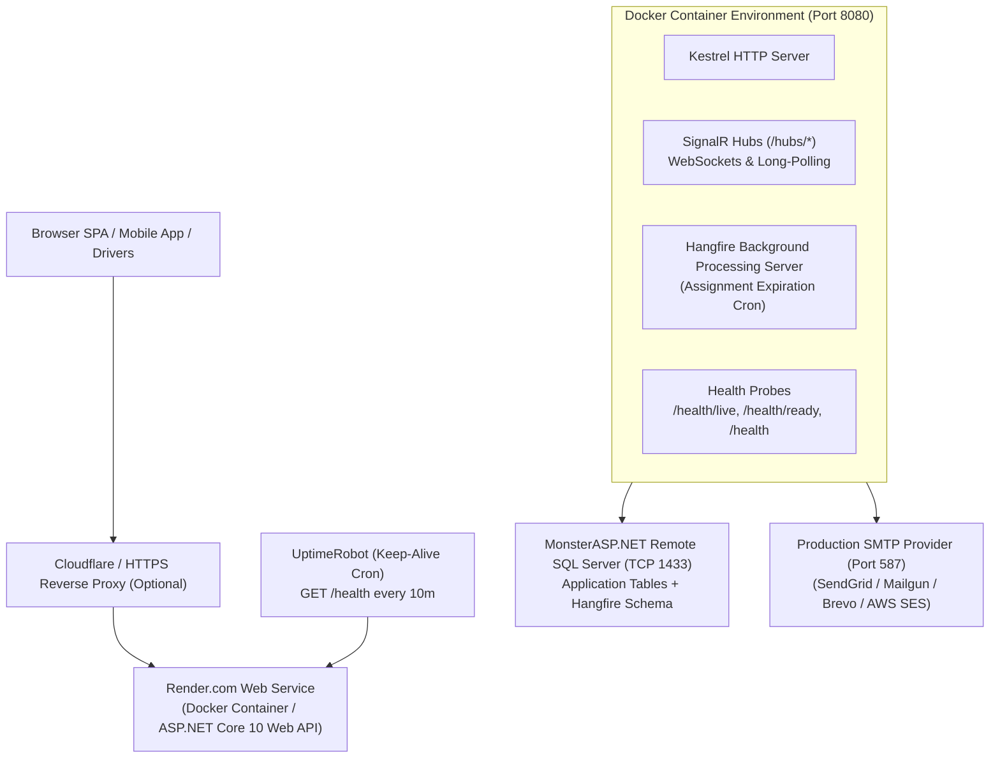

# Production Deployment & Operations Playbook — Logistics System API

This playbook provides comprehensive, production-tested instructions for configuring, deploying, monitoring, and operating the **Logistics System API** in a production cloud environment.

---

## 1. Hosting Architecture & Topology

The recommended production deployment topology utilizes a high-reliability, zero-cost stack:



| Component | Provider / Tool | Specs / Plan | Role |
|---|---|---|---|
| **App Service** | [Render.com](https://render.com) | Free Web Service (Docker) | Runs multi-stage .NET 10 container, handles HTTPS/TLS, auto-deploys via GitHub Actions |
| **SQL Database** | [MonsterASP.NET](https://monsterasp.net) | Free MS SQL Server Hosting | Remote SQL Server 2019/2022 instance with remote TCP 1433 access |
| **Keep-Alive** | [UptimeRobot](https://uptimerobot.com) | Free HTTP Monitor (10-min interval) | Pings `GET /health` to prevent Render free-tier cold starts |
| **Email Relay** | SendGrid / Mailgun / Brevo | Free SMTP Tier (Port 587) | Account verification & password reset emails |
| **CI/CD** | GitHub Actions | Ubuntu Runner | Automated restore, build, test suite execution, Docker validation, and deploy |

---

## 2. Environment Variables & Configuration Reference

All application secrets and environment-specific settings are injected using ASP.NET Core environment variable naming conventions (`Section__Key`).

| Variable Name | Required | Default / Example Value | Description |
|---|---|---|---|
| `ASPNETCORE_ENVIRONMENT` | **Yes** | `Production` | Sets runtime environment to Production. Disables developer exception pages. |
| `ASPNETCORE_URLS` | **Yes** | `http://+:8080` | Bind address and port for the internal Kestrel container server. |
| `ConnectionStrings__LogisticsSystem` | **Yes** | `Server=sqlX.monsterasp.net,1433;Database=...;User Id=...;Password=...;Encrypt=True;TrustServerCertificate=True;MultipleActiveResultSets=true;` | SQL Server connection string with TCP port 1433. |
| `Jwt__Issuer` | **Yes** | `LogisticsSystem` | JWT token issuer claim. |
| `Jwt__Audience` | **Yes** | `LogisticsSystemUsers` | JWT token audience claim. |
| `Jwt__SecretKey` | **Yes** | `Min32CharsCryptographicallySecureSecretKey123!` | Cryptographically strong secret key (minimum 256 bits / 32 characters). |
| `Jwt__AccessTokenExpirationMinutes` | No | `60` | Lifetime in minutes for JWT access tokens. |
| `Jwt__RefreshTokenExpirationDays` | No | `7` | Lifetime in days for sliding refresh tokens. |
| `Cors__AllowedOrigins__0` | **Yes** | `https://app.logistics.com` | Primary production web app origin. |
| `Cors__AllowedOrigins__1` | No | `https://admin.logistics.com` | Admin portal origin. |
| `Email__Provider` | **Yes** | `Smtp` | Sets email provider (`Smtp` for production, `Development` for fake logger). |
| `Email__SenderEmail` | **Yes** | `no-reply@logistics.com` | Outbound sender email address. |
| `Email__SenderName` | No | `Logistics System` | Friendly display name for outgoing emails. |
| `Email__SmtpHost` | **Yes** | `smtp.sendgrid.net` | SMTP relay server hostname. |
| `Email__SmtpPort` | **Yes** | `587` | SMTP port (587 for STARTTLS, 465 for SSL). |
| `Email__SmtpUser` | **Yes** | `apikey` | SMTP username or API key. |
| `Email__SmtpPassword` | **Yes** | `SG.xxxxxxxx...` | SMTP password or API secret. |
| `Email__EnableSsl` | No | `true` | Enables SSL/TLS transport encryption. |
| `Email__MaxRetries` | No | `3` | Number of retry attempts on SMTP transient network errors. |
| `Email__ConfirmationUrl` | **Yes** | `https://app.logistics.com/confirm-email` | Web app callback URL for account email confirmation. |
| `Email__ResetPasswordUrl` | **Yes** | `https://app.logistics.com/reset-password` | Web app callback URL for password reset. |
| `Dispatch__AssignmentExpirationMinutes` | No | `5` | Minutes before an unanswered driver dispatch assignment expires. |
| `Swagger__EnabledInProduction` | No | `false` | Set to `true` only if temporary OpenAPI schema diagnostics are required in staging. |

---

## 3. Database Setup & EF Core Migrations

### 3.1 Provisioning MonsterASP.NET SQL Server
1. Create a free account on [MonsterASP.NET](https://monsterasp.net).
2. Create a new **MS SQL Database** (e.g. `db_logistics_prod`).
3. Note the database credentials:
   - **Host / Server**: `mssqlXX.monsterasp.net,1433`
   - **Database Name**: `db_logistics_prod`
   - **Username**: `db_user_xxxx`
   - **Password**: `YourStrongPassword`
4. Confirm remote access is enabled for external TCP 1433 connections.

### 3.2 Applying EF Core Migrations
Execute migrations remotely from your local workstation or a bastion runner using the .NET EF CLI:

```bash
# Set your connection string
$Env:CONN_STRING="Server=mssqlXX.monsterasp.net,1433;Database=db_logistics_prod;User Id=db_user_xxxx;Password=YourStrongPassword;Encrypt=True;TrustServerCertificate=True;MultipleActiveResultSets=true;"

# Apply all pending migrations (including 20260824004342_AddProductionPerformanceIndexes)
dotnet ef database update `
  --project src/LogisticsSystem.Infrastructure `
  --startup-project src/LogisticsSystem.Api `
  --connection "$Env:CONN_STRING"
```

### 3.3 Generating Idempotent SQL Script (Alternative for DBA approval)
If your organization requires SQL review before deployment:
```bash
dotnet ef migrations script `
  --idempotent `
  --project src/LogisticsSystem.Infrastructure `
  --startup-project src/LogisticsSystem.Api `
  --output migrations_production.sql
```

---

## 4. Docker Container Operations

The application builds using a multi-stage, rootless, layer-cached `Dockerfile` producing a **106 MB** runtime container.

### 4.1 Building & Testing the Docker Image Locally
```bash
# Build the production image
docker build -t logistics-system-api:latest .

# Run the container locally with environment variables
docker run -d -p 8080:8080 `
  --name logistics-api `
  -e ASPNETCORE_ENVIRONMENT=Production `
  -e ConnectionStrings__LogisticsSystem="Server=mssqlXX.monsterasp.net,1433;..." `
  -e Jwt__SecretKey="SuperSecretKeyThatIsAtLeast32CharactersLong!" `
  -e Email__Provider="Smtp" `
  -e Email__SmtpHost="smtp.sendgrid.net" `
  -e Email__SmtpPort=587 `
  logistics-system-api:latest

# Check container logs
docker logs -f logistics-api

# Check container health status
docker inspect --format='{{json .State.Health}}' logistics-api
```

---

## 5. CI/CD Pipeline & Automated Deployment

### 5.1 Continuous Integration (`.github/workflows/ci.yml`)
- Triggers on every `push` and `pull_request` to `main`, `master`, and `feature/**`.
- Restores dependencies, builds the solution in `Release` mode, executes all 461 Unit and Integration tests, and uploads `.trx` test report artifacts.
- Compiles and validates the multi-stage Docker build.

### 5.2 Continuous Deployment (`.github/workflows/deploy.yml`)
- Triggers on `push` to `main` or manually via `workflow_dispatch`.
- Runs quality gate tests.
- Sends an authenticated POST request to Render's Deploy Hook (`secrets.RENDER_DEPLOY_HOOK_URL`).
- Performs post-deployment health check probing `https://your-app.onrender.com/health` with retry backoff.

### 5.3 Required GitHub Repository Secrets
Navigate to **GitHub Repository -> Settings -> Secrets and variables -> Actions** and configure:

| Secret Name | Description |
|---|---|
| `RENDER_DEPLOY_HOOK_URL` | Render Deploy Hook URL (found under Render Web Service -> Settings -> Deploy Hook). |
| `RENDER_APP_URL` | Public production URL (e.g. `https://logistics-api.onrender.com`). |

---

## 6. Render.com Web Service Deployment Steps

1. Log in to [Render.com](https://dashboard.render.com).
2. Click **New +** -> **Web Service**.
3. Connect your GitHub repository: `iAhmadMahmoud/LogisticsSystem`.
4. Configure service settings:
   - **Name**: `logistics-api`
   - **Region**: Frankfurt (EU Central) or Ohio (US East) — select region closest to your MonsterASP database.
   - **Branch**: `main`
   - **Runtime**: `Docker`
   - **Dockerfile Path**: `./Dockerfile`
   - **Docker Context**: `.`
   - **Instance Type**: `Free`
5. Under **Environment Variables**, add all keys from Section 2.
6. Under **Health Check Path**, enter: `/health/live`.
7. Click **Create Web Service**.

---

## 7. Rollback Procedures

### 7.1 Application Rollback (Render.com)
If a faulty build is deployed:
1. In Render Dashboard, navigate to **logistics-api** -> **Deploys**.
2. Identify the previous stable commit.
3. Click the three dots `...` next to the stable deploy and select **Rollback to this deploy**.
4. The previous Docker container image will be re-instantiated in under 30 seconds.

### 7.2 Database Migration Rollback
If a database schema change needs to be reverted:
```bash
# Roll back to the migration preceding the failed migration
dotnet ef database update <TargetMigrationName> `
  --project src/LogisticsSystem.Infrastructure `
  --startup-project src/LogisticsSystem.Api `
  --connection "$Env:CONN_STRING"
```

---

## 8. Subsystem Configuration & Verification

### 8.1 Health Checks & Keep-Alive Monitoring
The API provides 3 segregated health endpoints:
- `GET /health/live`: Liveness probe (used by Docker & Render orchestrators). Returns HTTP 200 `{ "status": "Healthy" }`.
- `GET /health/ready`: Readiness probe (evaluates SQL Server database connection and active dependencies).
- `GET /health`: Comprehensive sanitized health report.

#### UptimeRobot Keep-Alive Setup (Preventing Free Tier Sleep):
1. Sign up at [UptimeRobot.com](https://uptimerobot.com).
2. Add New Monitor:
   - **Monitor Type**: `HTTP(s)`
   - **Friendly Name**: `Logistics API Keep-Alive`
   - **URL**: `https://logistics-api.onrender.com/health`
   - **Monitoring Interval**: `10 minutes`
3. Click **Create Monitor**. This ensures Render never puts your container to sleep.

### 8.2 SignalR Realtime Hubs
- Hub Endpoints: `/hubs/notifications` and `/hubs/tracking`.
- Transport: WebSockets (fallback to Server-Sent Events / Long Polling).
- Authentication: Pass the JWT access token in the query string:
  ```javascript
  const connection = new signalR.HubConnectionBuilder()
    .withUrl("https://logistics-api.onrender.com/hubs/tracking", {
      accessTokenFactory: () => userJwtToken
    })
    .withAutomaticReconnect()
    .build();
  ```

### 8.3 Hangfire Background Jobs Dashboard
- Accessible at: `https://logistics-api.onrender.com/hangfire`.
- Authorization: Enforces `Roles.Admin`.
- Browser Access: Pass admin JWT in authorization header or query string: `https://logistics-api.onrender.com/hangfire?jwt=<ADMIN_ACCESS_TOKEN>`.
- Recurring Job: `expire-dispatch-assignments` runs minutely to automatically transition unaccepted assignments to expired and auto-dispatch to the next available driver.

### 8.4 Logging & Request Tracing
- Structured JSON & Console logging with correlation ID tracing.
- Send `X-Correlation-ID: <trace-id>` in request headers to trace distributed requests. All API responses include `X-Correlation-ID`.
- In case of error (4xx/5xx), the returned RFC 7807 `ProblemDetails` payload contains `{ "correlationId": "..." }` matching the server log entry.

---

## 9. Troubleshooting & Common Production Failures

| Issue / Symptom | Root Cause | Resolution |
|---|---|---|
| **Cannot open database / Login failed** | Connection string credentials incorrect, or MonsterASP database not created. | Verify `ConnectionStrings__LogisticsSystem` host, database name, username, and password in Render environment variables. Ensure `TrustServerCertificate=True;Encrypt=True;` is included. |
| **HTTP 500 on JWT Generation** | `Jwt__SecretKey` is shorter than 256 bits (32 chars) or missing. | Set `Jwt__SecretKey` to a cryptographically random string with at least 32 characters in Render environment variables. |
| **CORS Policy Rejection on Frontend** | Origin not listed in `Cors__AllowedOrigins`. | Add the frontend domain (e.g. `https://my-app.netlify.app` or `https://my-app.vercel.app`) to `Cors__AllowedOrigins__0` in Render. |
| **SignalR 401 Unauthorized Handshake** | Expired access token or missing query token extraction. | Ensure client passes `accessTokenFactory` with a valid, unexpired token. |
| **Hangfire Dashboard Access Denied (401/403)** | Missing `Admin` role or unauthenticated session. | Log in as an Admin user, generate access token, and visit `/hangfire?jwt=<token>`. |
| **Email Sending Fails / Times out** | SMTP credentials incorrect or firewall blocking port. | Verify `Email__SmtpHost`, `Email__SmtpPort` (587), `Email__SmtpUser`, and `Email__SmtpPassword`. Check SMTP relay account sender verification. |
| **Render Container Exits on Startup** | Port binding mismatch or fatal configuration error. | Ensure `ASPNETCORE_URLS=http://+:8080` is set and review logs in Render dashboard. |

---

## 10. Production Deployment Checklist

### Pre-Deployment
- [ ] Database created on MonsterASP.NET and TCP 1433 connectivity verified.
- [ ] All EF Core migrations applied (`dotnet ef database update`).
- [ ] Production SMTP credentials generated and verified.
- [ ] Frontend production origin URL confirmed for CORS configuration.
- [ ] JWT secret key generated (cryptographically strong, 32+ characters).
- [ ] GitHub repository secrets configured (`RENDER_DEPLOY_HOOK_URL`, `RENDER_APP_URL`).

### Deployment
- [ ] Push changes to `main` branch or trigger GitHub Actions CD workflow.
- [ ] Confirm GitHub Actions CI job passes all 461 unit & integration tests.
- [ ] Confirm Render build succeeds and container starts cleanly.

### Post-Deployment Verification
- [ ] Verify `GET https://your-app.onrender.com/health/live` returns HTTP 200 OK.
- [ ] Verify `GET https://your-app.onrender.com/health/ready` returns HTTP 200 OK.
- [ ] Verify `GET https://your-app.onrender.com/health` returns healthy database and email status.
- [ ] Configure UptimeRobot monitor for 10-minute keep-alive pings.
- [ ] Perform smoke test: Register a new customer, confirm email, login, and query profile.
- [ ] Log in as Admin and verify `/hangfire?jwt=<token>` dashboard shows recurring jobs active.
