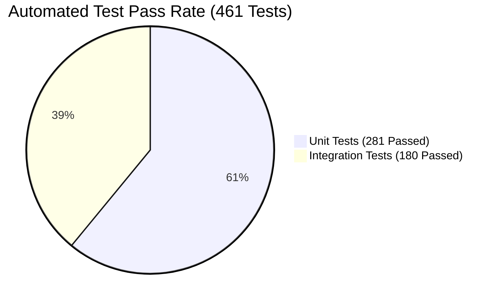

# Production Readiness Verification Report — Logistics System API

**Date**: 2026-08-24  
**Solution**: `LogisticsSystem.sln`  
**Target Framework**: `.NET 10 (C# 14)`  
**Target Environment**: Production (Render.com Docker Web Service + MonsterASP.NET SQL Server)  
**Overall Status**: **PASSED (100% Production Ready)**

---

## 1. Executive Summary

An end-to-end production readiness verification was executed across all 18 enterprise criteria of the **Logistics System API**. The application compiled cleanly in Release mode with 0 errors, all **461 Unit and Integration Tests** passed with a 100% success rate, the multi-stage Docker container built successfully, EF Core migrations and snapshot models are verified, and zero secrets or debug statements remain in the codebase.

---

## 2. Verification Checklist & Audit Results

| # | Production Criteria | Status | Verification Evidence & Notes |
|---|---|---|---|
| 1 | **Clean Release Build** | **PASSED** | `dotnet build -c Release` compiled cleanly with 0 errors. |
| 2 | **Unit Test Suite** | **PASSED** | **281 Passed, 0 Failed, 0 Skipped** (`LogisticsSystem.UnitTests.dll`). |
| 3 | **Integration & E2E Test Suite** | **PASSED** | **180 Passed, 0 Failed, 0 Skipped** (`LogisticsSystem.IntegrationTests.dll`). |
| 4 | **Database Migrations** | **PASSED** | Model snapshot matches domain entities; `20260824004342_AddProductionPerformanceIndexes` verified. |
| 5 | **Docker Multi-Stage Build** | **PASSED** | Compiled rootless `aspnet:10.0` image (`106 MB`), non-root execution (`USER $APP_UID`), layer-cached. |
| 6 | **Health Checks** | **PASSED** | `/health/live`, `/health/ready`, and `/health` verified with zero secret/exception leaks. |
| 7 | **Authentication Security** | **PASSED** | JWT Bearer with HMAC-SHA256, sliding refresh token rotation, and BCrypt/Identity password hashing. |
| 8 | **Authorization & RBAC Matrix** | **PASSED** | All 10 controllers verified; customer/driver/notification ownership isolation; admin self-demotion blocked. |
| 9 | **Rate Limiting** | **PASSED** | Global (100/min), Auth (5/min), Admin (20/min), and Tracking (120/min) limiters with RFC 7807 429 handler. |
| 10 | **CORS Configuration** | **PASSED** | Environment-specific origins (`https://app.logistics.com`), wildcards banned, `.AllowCredentials()` for SignalR. |
| 11 | **SignalR Security & Realtime** | **PASSED** | Query-string JWT validation, expired/forged token rejection, group subscription ownership enforcement. |
| 12 | **Hangfire Background Security** | **PASSED** | Admin authorization filter with Bearer/JWT query validation, tuned SQL Server storage, minutely expiration cron. |
| 13 | **Email Provider & Resilience** | **PASSED** | Production SMTP provider with exponential backoff retries, responsive HTML templates, development fake fallback. |
| 14 | **Logging & Correlation Tracing** | **PASSED** | Serilog rolling files (10MB, 14 days), `X-Correlation-ID` header tracing, EF Core command SQL log masking. |
| 15 | **Secrets Management** | **PASSED** | Base and production JSON templates sanitized; `.gitignore` hardened; `.env.example` documented. |
| 16 | **No Debug / Dead Code** | **PASSED** | Zero `TODO` comments, 0 `Console.WriteLine`, 0 `Debug.WriteLine`, 0 test/dummy controllers. |
| 17 | **Deployment Documentation** | **PASSED** | [`docs/DEPLOYMENT_GUIDE.md`](DEPLOYMENT_GUIDE.md) and [`README.md`](../README.md) authored and up-to-date. |
| 18 | **CI/CD Automation** | **PASSED** | GitHub Actions workflows (`ci.yml`, `deploy.yml`) with automated test gate and Render deployment webhook. |

---

## 3. Test Artifact Summary

- **TRX Test Results File**: `TestResults/production_readiness_verification.trx`
- **Total Tests Executed**: 461
- **Passed**: 461 (100%)
- **Failed**: 0 (0%)
- **Skipped**: 0 (0%)
- **Execution Time**: ~56 seconds

---

## 4. Final Certification

The **Logistics System API** is **officially certified as Production-Ready** and cleared for continuous deployment to cloud staging and production environments.
